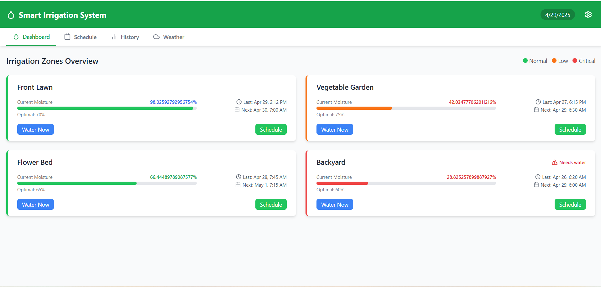

# Smart Irrigation System Web Application

# Live Link:- https://irrigation-system-sand.vercel.app/

A modern web application built with React.js and Tailwind CSS for monitoring and managing an automated irrigation system. This application provides real-time moisture monitoring, watering scheduling, historical data visualization, and weather integration.



## Features


### Dashboard
- Real-time monitoring of soil moisture levels across multiple zones
- Visual indicators for moisture status (normal, low, critical)
- Quick action buttons for immediate watering or scheduling
- At-a-glance view of last watered time and next scheduled watering

### Schedule Management
- Comprehensive schedule table for all zones
- Easy scheduling interface with date and time picker
- Status indicators for each zone
- One-click rescheduling

### Historical Data
- 7-day moisture level trends visualization
- Water usage statistics by zone
- Interactive charts with detailed information

### Weather Integration
- Current weather conditions display
- 3-day weather forecast
- Weather-based adjustments for smart irrigation
- Rain delay, seasonal adjustment, and wind compensation features

## Technologies Used

- **React.js**: Frontend library for building the user interface
- **Tailwind CSS**: Utility-first CSS framework for styling
- **Recharts**: Composable charting library for data visualization
- **Lucide React**: Icon library for visual elements
- **Context API**: For state management across components


## Getting Started

### Prerequisites

- Node.js and npm installed on your machine

### Installation

1. Clone the repository:
```bash
git clone https://github.com/yourusername/irrigation-system.git
cd irrigation-system
```

2. Install dependencies:
```bash
npm install
```

3. Start the development server:
```bash
npm start
```

4. Open your browser and navigate to `http://localhost:3000`

## Usage

### Monitoring Moisture Levels

The dashboard provides real-time moisture information for all irrigation zones. Each zone card shows:
- Current moisture percentage
- Optimal moisture level
- Visual indicators for status (green = normal, orange = low, red = critical)
- Last watered time and next scheduled watering

### Managing Watering Schedules

1. Click the "Schedule" button on any zone card
2. Select date and time for the next watering
3. Click "Save Schedule" to confirm

For immediate watering, click the "Water Now" button on any zone card.

### Viewing Historical Data

Navigate to the History tab to view:
- 7-day moisture trends for all zones
- Water usage statistics by zone

### Weather Integration

The Weather tab displays:
- Current weather conditions
- 3-day forecast
- Weather-based adjustment settings

## Future Enhancements

- User authentication and profiles
- Mobile app integration
- Smart home device compatibility (Google Home, Amazon Alexa)
- Machine learning for predictive watering schedules
- Water conservation analytics
- Email/SMS notifications for critical moisture levels

## Contributing

1. Fork the repository
2. Create your feature branch (`git checkout -b feature/amazing-feature`)
3. Commit your changes (`git commit -m 'Add some amazing feature'`)
4. Push to the branch (`git push origin feature/amazing-feature`)
5. Open a Pull Request

## License

This project is licensed under the MIT License - see the LICENSE file for details.

## Acknowledgments

- Icons provided by [Lucide Icons](https://lucide.dev/)
- Chart components powered by [Recharts](https://recharts.org/)
- Styling with [Tailwind CSS](https://tailwindcss.com/)
